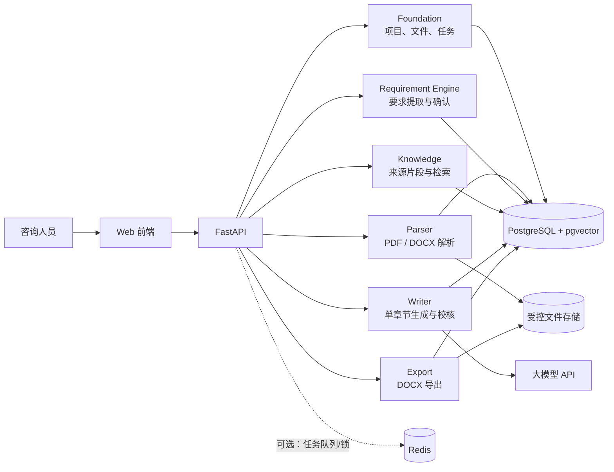
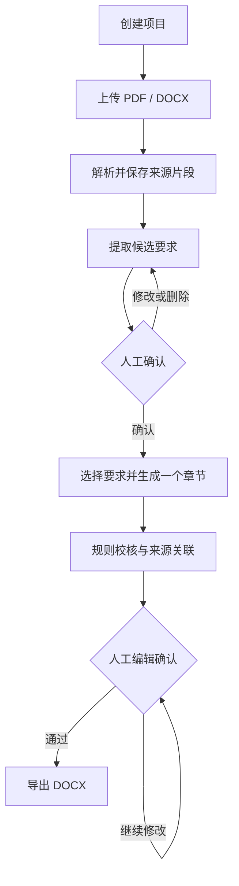

# Bid Agent MVP 技术架构

## 1. 架构原则

MVP 使用“一个前端、一个 API、一个数据库、一个文件存储目录”的简单结构。六个业务层是代码边界，不拆成六个微服务。

- 先保证闭环和可追溯，再增加智能编排。
- PostgreSQL 是业务状态的唯一事实来源。
- 文件保存在受控存储中，数据库只保存元数据和路径。
- 耗时操作通过任务记录支持重试和断点继续。
- Redis 在 MVP 中只用于任务队列或短期锁，不保存最终业务结果。

## 2. 一目了然的系统结构

## 3. 业务执行流程

## 4. 六层职责

### Foundation

负责项目、上传文件、处理任务、统一错误、配置和审计字段。其他层不能绕过 Foundation 创建孤立数据。

### Parser

负责文件校验、PDF 分页文本提取、DOCX 段落提取和标准化片段。输出稳定的 `SourceChunk`，不负责判断业务要求。

### Requirement Engine

从来源片段提取候选要求，合并重复项，给出分类、置信度和来源引用。人工确认后形成可用于写作的要求。

### Knowledge

管理来源片段和向量索引，按项目隔离检索。MVP 先支持来源回看和基础检索，RAG 增强后置。

### Writer

根据章节标题、已确认要求和可用来源生成单章节；记录输入快照、草稿版本、要求映射和校核结果。

### Export

把已保存的章节版本和要求响应清单渲染成 DOCX，保存导出记录和文件校验信息。

## 5. 核心数据模型

| 实体 | 关键字段 | 说明 |
| --- | --- | --- |
| `Project` | id, name, status, created_at, updated_at | 投标工作空间 |
| `Document` | id, project_id, filename, media_type, sha256, status, storage_key, error | 原始招标文件 |
| `SourceChunk` | id, document_id, page_no, paragraph_start, paragraph_end, text | 可追溯来源片段 |
| `Requirement` | id, project_id, type, title, normalized_text, quote, status, confidence | 候选或已确认要求 |
| `RequirementSource` | requirement_id, source_chunk_id, locator | 要求与原文的多对多关联 |
| `Section` | id, project_id, title, status, current_version_id | 技术方案章节 |
| `SectionRequirement` | section_id, requirement_id | 章节响应的要求 |
| `SectionVersion` | id, section_id, version_no, content, origin, input_snapshot | 机器生成和人工编辑版本 |
| `ReviewFinding` | id, section_version_id, type, severity, message | 生成校核结果 |
| `ProcessingJob` | id, project_id, type, status, progress, error, retry_of | 可重试耗时任务 |
| `ExportRecord` | id, project_id, section_version_id, status, storage_key, error | DOCX 导出记录 |

所有业务表使用 UUID、创建时间和更新时间。对项目相关查询必须带 `project_id`，避免跨项目读取。

## 6. 一致性与失败恢复

- 文件写入成功后再提交数据库元数据；数据库失败时清理未引用临时文件。
- 解析、提取、生成和导出都创建 `ProcessingJob`。
- 任务输入保存不可变快照，重试创建新任务并指向原任务。
- 章节采用追加版本，不覆盖旧版本。
- 同一文件通过项目 ID 与 SHA-256 去重。
- API 使用幂等键避免重复提交生成和导出。

## 7. 部署拓扑

本地 Mac 用于编辑、静态检查和不依赖完整服务的单元测试。

ECS `/opt/bid-agent` 使用 Docker Compose 运行：

- `frontend`
- `api`
- `worker`（需要异步任务时启用，与 API 共用代码镜像）
- `postgres`（启用 pgvector）
- `redis`

生产入口只暴露 Web 所需端口；PostgreSQL、Redis 和内部 API 不直接暴露到公网。上传与导出目录使用持久卷并定期备份。

## 8. 安全边界

- `.env` 不进入 Git；仓库只保留无真实值的 `.env.example`。
- 外部模型密钥和数据库密码由 ECS 环境注入，并定期轮换。
- API 日志只记录任务 ID、状态、耗时和错误类别，不记录密钥或整段文件正文。
- 下载接口校验项目归属，使用不可猜测 ID。
- 文件名仅作显示；实际存储键由系统生成，防止路径穿越。

## 9. 已知限制与演进

- DOCX 没有跨环境稳定页码，MVP 以段落定位；需要页码时引导上传 PDF。
- 扫描 PDF 后续增加 OCR。
- 初期可在 API 进程执行小任务；真实样例验证耗时后再启用 worker。
- pgvector 先保留能力，不让 RAG 成为 MVP 主流程的前置条件。
- LangGraph 仅在流程分支和恢复复杂度确实需要时引入。

