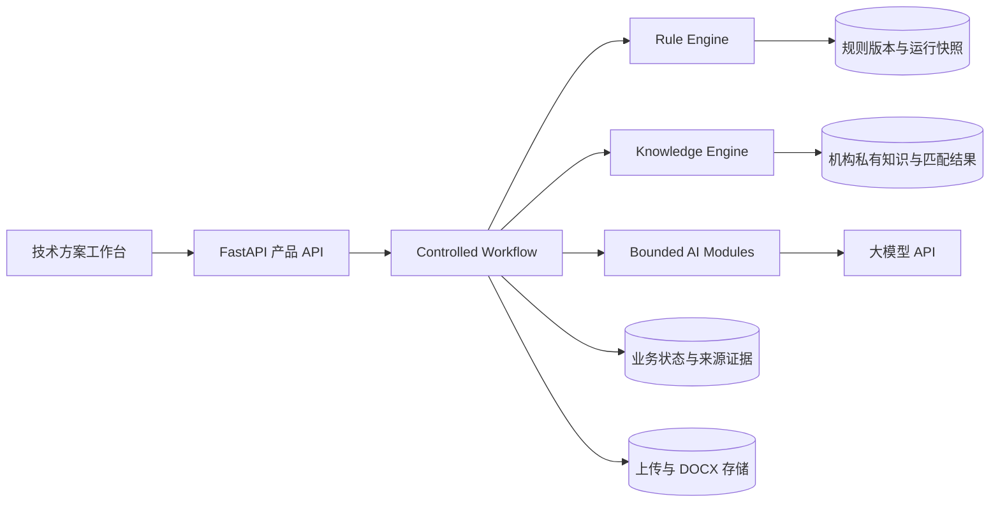
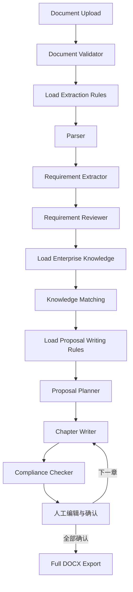

# Bid Agent 可演进架构

## 1. 架构目标

Bid Agent 采用 Rule Driven、Knowledge Driven、Workflow Driven 三层底座。
模型不是业务规则的持有者，只在明确输入、输出和终止条件的节点中执行抽取或写作。

## 2. 受控调用流程

`workflow_runs.stage_trace` 保存有限阶段轨迹。流程代码只能调用表中定义的阶段，
没有 Agent 自由对话、自治工具选择或无限循环。

## 3. Rule Engine

默认配置位于 `config/rules/`，数据库中的激活规则可覆盖默认配置。Rule Engine
负责：

- 规则结构校验；
- 草稿、激活和退役；
- 单类型唯一激活版本；
- Git 默认版本与数据库定制版本的统一加载；
- 校验和与不可变运行快照；
- 为未来 `ai_generated` 规则保留来源字段，但 AI 生成版本必须先进入草稿。

规则类型：

| 类型 | 控制内容 |
| --- | --- |
| extraction | 文件有效性、候选证据、忽略项、Requirement 定义、分类、命名、方案映射 |
| writing | 目录顺序、章节风格、事实边界、知识引用、篇幅、重复率和术语策略 |
| compliance | 长度、禁用表述、占位符、Requirement/Knowledge 可追溯门禁 |

模型收到的是“当前规则版本内容 + 本阶段数据”，而不是代码中的永久超长 Prompt。

## 4. Knowledge Engine

Enterprise Knowledge 只保存机构有权使用的私有知识：

- company_profile
- qualification
- product_capability
- technical_capability
- case_study
- standard_template
- expert_experience
- historical_bid
- common_chapter

Knowledge Matching 在 Chapter Writer 之前完成。匹配输入是章节标题和映射
Requirements；输出是按相关度排序的明确知识集合。`knowledge_matches` 保存知识、
章节、Requirement、分数和理由；`section_versions.knowledge_snapshot` 固化生成时
使用的知识。

没有匹配知识并不会让 Writer 自由搜索。凡涉及企业事实，必须输出待补充占位符。

历史招标文件只有通过有效性、解析质量、SHA-256 重复性和机构权限检查后才成为
`historical_bid`，范围固定为 `organization_private`，仅用于后续私有 RAG。

## 5. 业务数据

| 实体 | 核心职责 |
| --- | --- |
| projects | 内部 workspace；新前端不向用户暴露“项目”概念 |
| documents / source_chunks | 文件、有效性、私有知识资格和页码/段落证据 |
| requirements | 规范化要求及 proposal_relevance、target_chapter、need_generation |
| requirement_sources | Requirement 到原文证据的多对多映射 |
| sections / section_requirements | 推荐目录及 Requirement 到章节的映射 |
| section_versions | 生成/人工版本、规则快照、知识快照和输入快照 |
| review_findings | 版本化合规校核结果 |
| rule_definitions | 可编辑、可激活、可审计的规则版本 |
| enterprise_knowledge | 机构私有企业知识 |
| knowledge_matches | 写作前知识匹配证据 |
| workflow_runs | 有限工作流轨迹和失败位置 |
| export_records | 单章节兼容导出与整本方案导出 |

## 6. 模块边界

- Document Validator：只判断输入是否值得进入后续流程。
- Parser：只把 PDF/DOCX 转为可定位 SourceSegment。
- Requirement Extractor：依据加载的 extraction rule 调用模型。
- Requirement Reviewer：确定方案相关性与目标章节，不调用模型。
- Knowledge Matching：一次性加载私有知识并匹配，不写正文。
- Proposal Planner：按 writing rule 和映射生成有序目录。
- Chapter Writer：只用 Requirement 证据、Matched Knowledge 和 writing rule。
- Compliance Checker：按 compliance rule 执行有限检查。
- Export：按确认版本顺序生成完整 DOCX 和来源总表。

## 7. 安全与演进

- 密钥仅从环境读取，规则、知识快照和日志均不得保存密钥。
- 机构私有知识不进入公共训练集，产品文案不得称为“模型训练”。
- 当前 MVP 是单机构部署。多租户前必须增加真实身份认证、organization_id
  行级权限、对象存储签名 URL 和审计日志。
- AI 自动优化规则只能生成新草稿，必须经过专家差异审查和离线样本回归后激活。
- 向量检索可替换当前确定性初筛，但 Knowledge Matching 的显式前置阶段和快照
  不能被移除。

## 8. 跨项目复用边界

主流程、数据库实体和模块接口属于稳定层，不因招标项目变化。可变内容统一放在
`config/rules/`，需要企业定制时创建新的规则版本，不复制 Agent 或 Service。

| 可变内容 | 配置位置 | 消费模块 |
| --- | --- | --- |
| 有效招标文件判定、候选词、忽略项 | `extraction.document_validation`、`candidate_markers`、`ignore_*` | Document Validator、Requirement Extractor |
| Requirement 类型、方案相关性和章节路由 | `extraction.types`、`proposal_mapping`、`proposal_routing_defaults` | Requirement Extractor、Requirement Reviewer |
| 推荐目录与章节风格 | `writing.chapter_order`、`chapter_styles` | Proposal Planner、Chapter Writer |
| 事实边界、篇幅和写作约束 | `writing.policies`、`knowledge_category_policy` | Chapter Writer |
| 知识准入、匹配权重和数量 | `knowledge.eligibility`、`matching`、`fact_boundaries` | Knowledge Engine |
| 校核项、严重级别和可追溯要求 | `compliance.checks`、`required_traceability` | Compliance Checker |
| 模型、端点、批次和切分参数 | 私密 `.env`；字段模板见 `.env.example` | Model Gateway、Ingestion |

以下内容保持稳定，不进入项目规则：上传与会话安全、任务状态、失败重试、阶段轨迹、
来源快照、人工确认和 DOCX 交付。这样更换项目时只激活一组经过测试的规则版本，
无需重新组装工作流。
