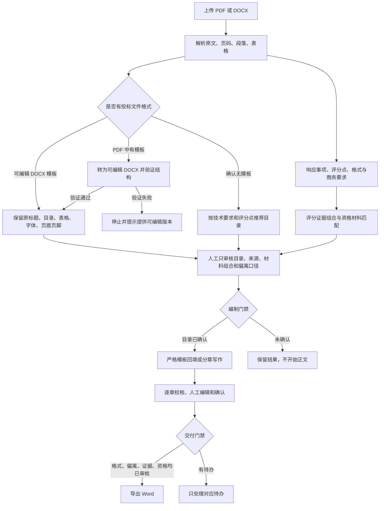

# 投标业务验收闭环

> 依据本轮投标业务人员反馈整理。目标是让系统交付“可审核的投标响应”，而不是增加更多自由 Agent。

## 1. 架构决策

采用增量升级，不推倒重来。现有文档解析、模板保真、Requirement、实体关系、知识权限、异步任务、来源追溯和 Word 导出继续作为主干；新增一个本地规则驱动的 Bid Readiness 层，统一控制目录、格式、商务偏离、评分材料和资格附件的人工审核状态。

这样做的原因：

- 模板识别和严格回填已经具备真实文件回归基础，重写会放大格式损坏风险。
- 评分材料数量、去重、人员社保和合同审批属于确定性业务规则，不需要反复调用模型。
- 人工应审核系统找到的结果和来源，不应在工作台重复录入企业数据。
- 历史中标文件只提供结构和写法参考，不能自动变成企业业绩、人员或资质事实。

## 2. 用户主流程

## 3. 评分材料组合逻辑

评分点先转换为可解释的材料计划：

1. 解析每项分值和最高分，计算拿满分所需最低数量。
2. 业绩通常在最低数量上增加 2 份，人员通常增加 1 人，且不超过规则上限。
3. 先按业务类型或证书类别筛选，再检查客户性质、人员所属单位或社保关系。
4. 按合同编号或人员去重；“一人多证只计一次”时不得重复计分。
5. 只选择已核验、已关联真实文件并有原文件位置的企业材料。
6. 合同全页未取得内部审批时，只显示候选并阻止正式交付。
7. 业务人员确认整组材料，不需要逐字段录入。

## 4. 两套写作策略

| 条件 | 写作器 | 行为 |
|---|---|---|
| 已验证的可编辑模板 | `strict_template_writer` | 原目录、表格、样式和槽位为唯一骨架 |
| 确认没有指定模板 | `planned_proposal_writer` | 根据技术要求、评分点和历史结构生成目录，再分章写作 |
| PDF 模板尚未可靠转换 | 不进入写作器 | 保留文件与解析结果，等待可靠转换或可编辑版本 |

## 5. 人工审核与失效机制

- 每个审核事项保存内容摘要校验值。
- 目录、规则输入或候选材料变化后，旧确认自动失效，防止“确认 A、交付 B”。
- 目录未确认时，API 和后台 Worker 都禁止生成章节。
- 格式、商务偏离、评分证据或资格材料未完成时，禁止正式导出。
- 资料不足时不能靠点击“确认”绕过；必须先补齐可核验资料。
- 当前项目只展示可读名称、来源文件和位置，不展示数据库主键或内部字段。

## 6. 企业知识边界

当前五组真实招标和中标文件是机构私有的案例参考库：

- 可以用于目录结构、章节写法和业务场景参考。
- 不可以作为当前企业的法人、人员、资质、合同或业绩事实。
- 真正自动填写和评分材料装配，需要企业主数据、项目合同台账、人员证书库及真实附件位置。
- 正式接口接入后仍沿用 Organization、Person、ProjectRoleAssignment、BusinessCase、Certificate 和 EvidenceAsset 的实体主键，不改变工作台主流程。

## 7. 能耗与性能策略

- 格式路由、数量计算、去重、审批门禁和审核状态全部在本地规则层完成，不调用模型。
- 同一评分事项一次生成证据组合，人工一次确认，不逐空格或逐附件反复对话。
- 模型只用于文档语义理解和正文写作，继续通过异步队列执行，HTTP 请求不等待长调用。
- 后台执行前二次校验门禁，避免无效模型调用和过时目录产生浪费。
- 规则独立版本化，后续业务口径变化只更新配置和小型匹配器，不重写主链路。

## 8. 当前仍需外部条件的能力

- 钉盘/钉钉知识库、合同台账、人员证书和社保资料的正式授权接口。
- 合同全页的真实审批结果接口。
- 企业材料原文件的受权预览或下载地址。
- 图片附件按实体主键插入 Word 的下一阶段实现。

在这些接口到位前，系统只展示已有可核验候选，不生成或猜测企业事实。
