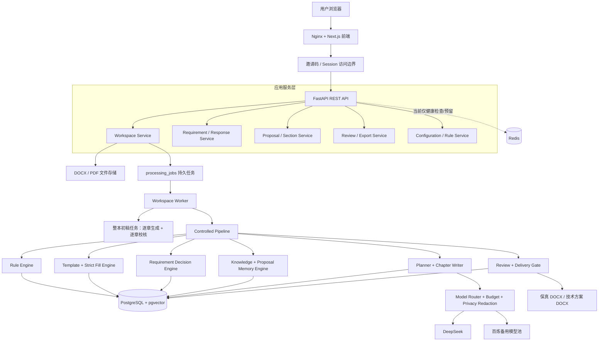
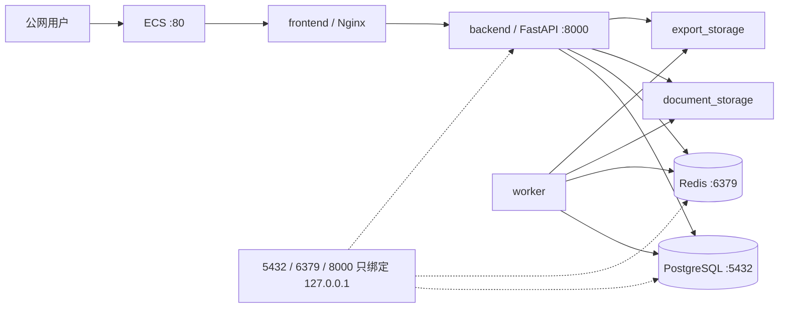
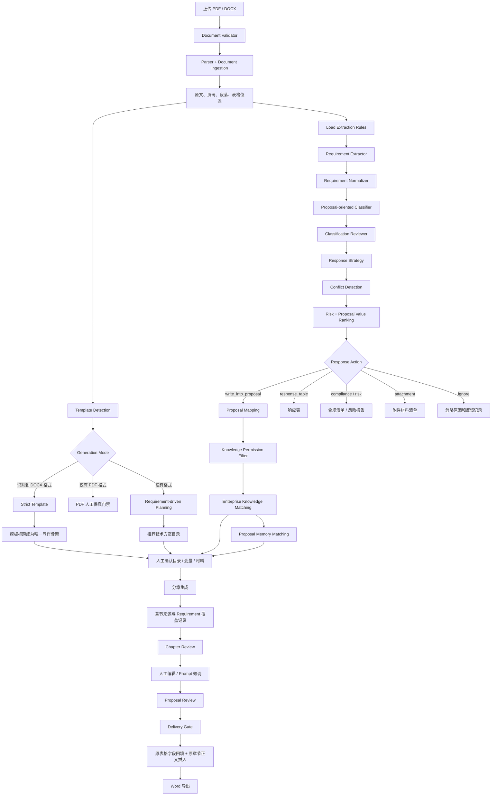
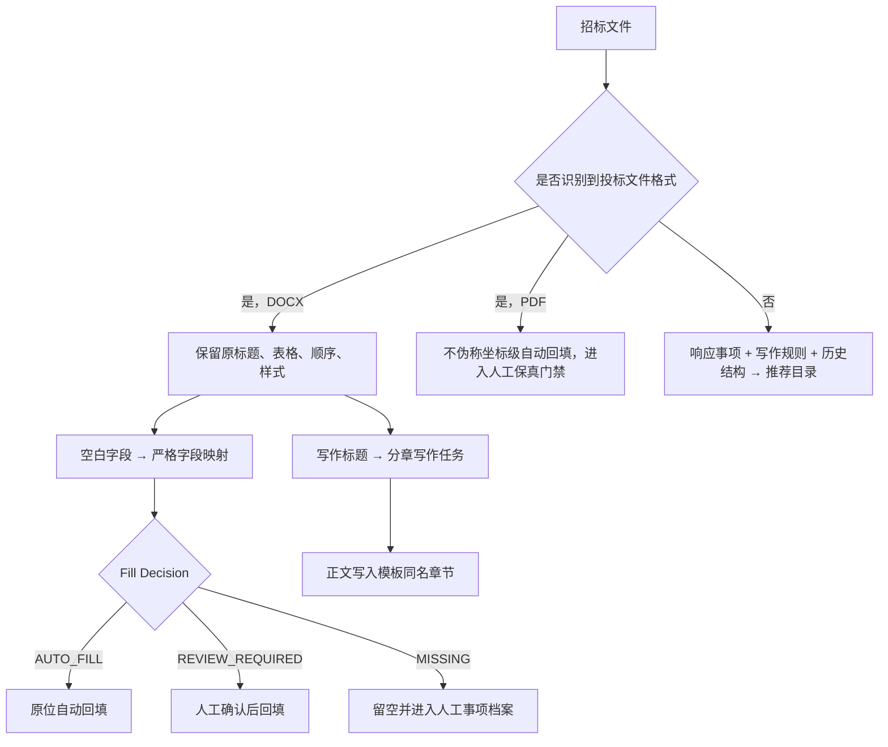
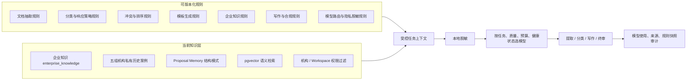
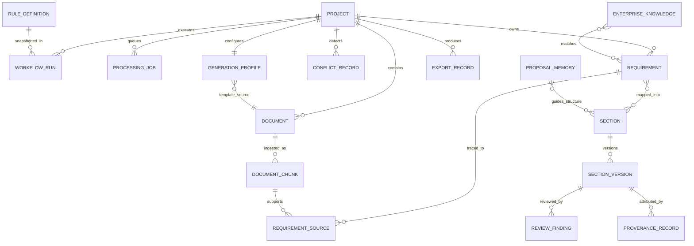
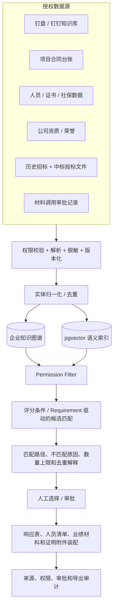
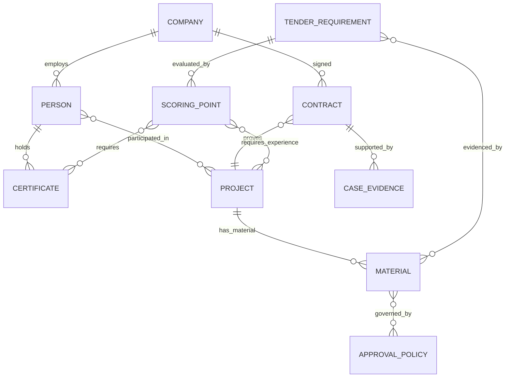

# Bid Agent 当前完整架构与知识图谱演进图

> 更新日期：2026-08-08  
> 口径：已实现与未实现能力分开标注，本文可直接提供给 ChatGPT 或其他架构评审人员。

## 1. 产品定位

Bid Agent 不是“上传文件后让大模型自由写标书”，而是一套受控的投标响应决策与交付系统：

```text
理解招标文件
  → 保留原始格式和来源
  → 决定每个响应事项如何处理
  → 在权限内匹配企业事实和历史结构
  → 按招标模板回填或按章生成
  → 追溯、校核、人工确认
  → 导出 Word
```

三条底线：

1. 规则驱动，不把业务规则全部写死在 Prompt 中。
2. 企业事实必须有权威来源，历史标书不等于企业事实。
3. 任务流程是有限状态机，Agent 不允许自由对话或无限循环。

## 2. 当前系统总体架构



### 当前部署拓扑



当前正式运行和大文件分析环境为阿里云 ECS。本地 Mac 主要负责代码修改、单元测试和轻量回归。

## 3. 完整业务执行链路



## 4. 模板优先生成决策



## 5. Rule Engine、Knowledge Engine 和 Model Router



## 6. 当前核心数据关系



注：这是业务关系图，不代表每个关系都以单独物理关联表实现；部分匹配和快照当前保存在 JSONB 或工作流记录中。

## 7. 当前已实现、部分实现与待实现

| 能力 | 状态 | 说明 |
|---|---|---|
| PDF / DOCX 上传、解析与有效性判断 | 已实现 | 支持原文分块和来源保留 |
| Requirement 抽取、标准化、分类、响应决策 | 已实现 | 含风险、方案价值、响应动作和目录映射 |
| 冲突检测和四种人工决策 | 已实现 | 提交澄清只暂停受影响章节 |
| DOCX 格式识别与原表回填 | 已实现 | 表格与写作章节均服从已识别模板 |
| 分章生成、校核、人工编辑、Word 导出 | 已实现 | 支持来源追溯和交付门禁 |
| 五组历史中标案例结构参考 | 已实现 | 仅限机构私有结构学习，禁止转化为企业事实 |
| 企业事实严格三态回填 | 已实现底层 | 真实企业数据 API 未接入，因此许多字段仍是待审核或缺失 |
| 业绩、人员、证书、社保和评分数量自动配组 | 部分实现 | 策略和接口边界已有，待真实台账和钉钉 API |
| 扫描 PDF 坐标级保真回填 | 未实现 | 当前不伪称可自动回填，保持人工门禁 |
| 企业知识图谱 | 未实现 | 现有追溯数据可作为图谱迁移基础 |

## 8. 企业知识图谱演进架构（下一阶段）

不建议立即引入一个独立的“大而全图数据库”。先在 PostgreSQL 中建立稳定的企业实体、关系和证据模型，结合 pgvector 做候选召回；只有当多跳关系查询成为性能瓶颈时，再同步到 Neo4j 或其他图引擎。



### 建议的图谱实体

- `Company`：公司、分支机构、统一社会信用代码。
- `Person`：人员；敏感证件值不直接进通用图谱。
- `Certificate`：资质或人员证书、有效期和签发机构。
- `Project`：历史项目、行业、地区和服务类型。
- `Contract`：合同编号、甲方、服务内容、时间和可用材料范围。
- `CaseEvidence`：合同首尾页、中标通知书、评价函等证据。
- `TenderRequirement`：当前项目的响应事项。
- `ScoringPoint`：采分条件、数量、上限、一人多证等规则。
- `Material`：可装配文档或图片，只保存受控存储引用。
- `ApprovalPolicy`：例如合同全页需业务发展部审批。

### 建议的核心关系



### 图谱设计底线

1. 图谱节点必须带 `organization_key`、来源、版本、核验状态和权限范围。
2. 图谱中的“关系”也必须有证据，不能只因为语义相似就生成事实边。
3. 身份证号、证件原图等保存在受控数据仓，图谱只保存脱敏属性和受控引用。
4. 语义检索用于召回候选，结构化规则和人工审核决定能否真正使用。
5. 不把知识图谱称为“模型训练”，它是机构私有、可追溯的检索和决策数据层。

## 9. 知识图谱实施顺序

1. 先定义实体 ID、来源和权限模型。
2. 先接入公司、项目合同台账、人员证书索引三类高价值数据。
3. 建立台账记录到证明材料的可审计关联。
4. 用真实评分办法验证“条件 → 候选人员/业绩 → 材料”的匹配路径。
5. 再接入钉钉文件下载和审批流。
6. 最后评估是否真的需要独立图数据库，避免过早增加运维复杂度。

## 10. 当前需要特别关注的架构债务

1. **任务队列**：当前 Worker 从 PostgreSQL `processing_jobs` 通过 `SKIP LOCKED` 取任务，Redis 还没有真正承接队列。单机 MVP 可用，多 Worker 并发前应评估 Redis Queue / Celery / RabbitMQ。
   上传解析和整本初稿均已采用持久任务；初稿只生成和校核，不自动批准。Worker 常驻期间周期恢复超时任务，浏览器断开不影响继续运行。
2. **目录层级持久化**：模板能识别五级标题，但当前生成任务的 Section 模型仍偏扁平，父子节点编辑需后续迁移。
3. **企业权威事实**：严格回填决策已存在，但真实企业数据接口未打通前，不能大规模自动回填。
4. **扫描件保真**：需要 OCR、表格坐标、图片槽位和版式渲染对比后，才能对扫描 PDF 宣称自动保真回填。
