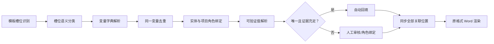

# 《Variable Layer Architecture Upgrade Report》

## 1. 升级目标

本次不替换现有严格回填和无模板写作器，而是在模板槽位与实体取值之间增加可稳定演进的业务变量层。

```text
Document Slot
  → Semantic Variable
  → Entity / Role Binding
  → Verified Value Resolution
  → Strict Template Render
```

同一业务事实在原模板出现多次时，系统只匹配和审核一次，再同步到所有物理位置。

## 2. 本次实现

### Variable Dictionary

- 新增版本化变量字典 `config/rules/variable_dictionary.default.json`。
- 变量保存稳定键、标准名、别名、语义属性、目标实体、目标角色、值类型和来源优先级。
- 法定代表人、授权代表、项目负责人、技术负责人、联系人和签署人按“项目/组织 + 角色 + 属性”生成变量，不再因都叫“姓名”而混合。
- 角色未识别的人员槽位保持分离，禁止自动合并或猜人。

### Slot Deduplication

- 所有原模板位置仍保留页/章节/段落/表格坐标和上下文。
- 系统先将物理槽位归并为业务变量，再按变量合并值、状态、证据和实体候选。
- 同一变量出现冲突值时会降级为 `REVIEW_REQUIRED`，不自动选择。
- 变量确认结果会 fan-out 到所有原字段，因此不破坏旧的 Word 渲染器和数据契约。

### Entity Binding

- 变量只在“实体、角色、属性”唯一定位后才能自动回填。
- 人员信息沿同一 `person_id` 取姓名、职务、电话、身份证和证照，防止跨人拼接。
- 审核接口按 `variable_key` 确认，完成后同步所有关联槽位并保存审核时间、证据和影响位置数。
- 已识别的业务变量不允许在前端随意输入；缺数据时应先更新受控企业事实或建立项目角色绑定，用户只负责审核。

### Personnel Rule Foundation

- 新增配置化人员规则和评估引擎，支持在职状态、证书有效性和经验年限门禁。
- 人员表预留任职、角色、证书和项目参与 JSONB 历史，为后续人员资格匹配和知识图谱投影提供稳定来源。
- 证据不足或规则不满足时一律进入人工审核，不由模型补齐。

## 3. 运行链路



`strict_template_writer` 继续使用这条链路。`planned_proposal_writer` 仅在确认无模板时启用，不受变量层改造影响。

## 4. API 与界面

- Workspace 新增 `template_variable_decisions`，同时保留 `template_field_decisions` 供旧渲染链路使用。
- `POST /api/v1/workspaces/{workspace_id}/template-variables/review` 按业务变量确认或重置。
- 前端显示“N 个业务变量覆盖 M 个原模板位置”；可展开查看每个原始位置、上下文和证据。
- 用户可选择已核验候选人并建立项目角色，不需要重复填写同一事实。
- 用户可见内容不展示 `custom_*`、UUID、内部来源代码或数据库字段。

## 5. 验证结果

- 变量字典、槽位去重、角色隔离、一次变更同步多位置：6 项新测试通过。
- 原有 Entity Resolution / Generation Profile / Response Template 聚焦回归：54 项通过。
- 真实自贡 DOCX：识别 151 个物理槽位，收敛为 109 个业务变量，合并 42 个重复位置。
- Python `compileall` 与本次变更的 `pyflakes` 检查通过。
- 前端静态测试 2/2 通过，独立 Docker production build 通过，浏览器真实打开页面且无内部字段可见泄漏。

## 6. 数据库与交付边界

- 迁移文件为 `database/migrations/026_variable_layer.sql`。
- 本轮未对本地或生产数据库执行迁移，未部署，未调用外部模型。
- 回滚时可撤销本次代码提交；若已执行迁移，应在备份验证后删除新增索引与四个历史字段。

## 7. 后续建议

1. 待企业正式人员库接入后，将任职、证书、项目参与和附件索引按实体主键导入。
2. 将人员规则评估结果接入资格评分匹配，仍以 PostgreSQL 为事实源，Neo4j 只作可重建关系投影。
3. 图片和证照必须先完成 `person_id` / `organization_id` 绑定，再根据材料类型和权限取原件，禁止只用向量相似度选人。
